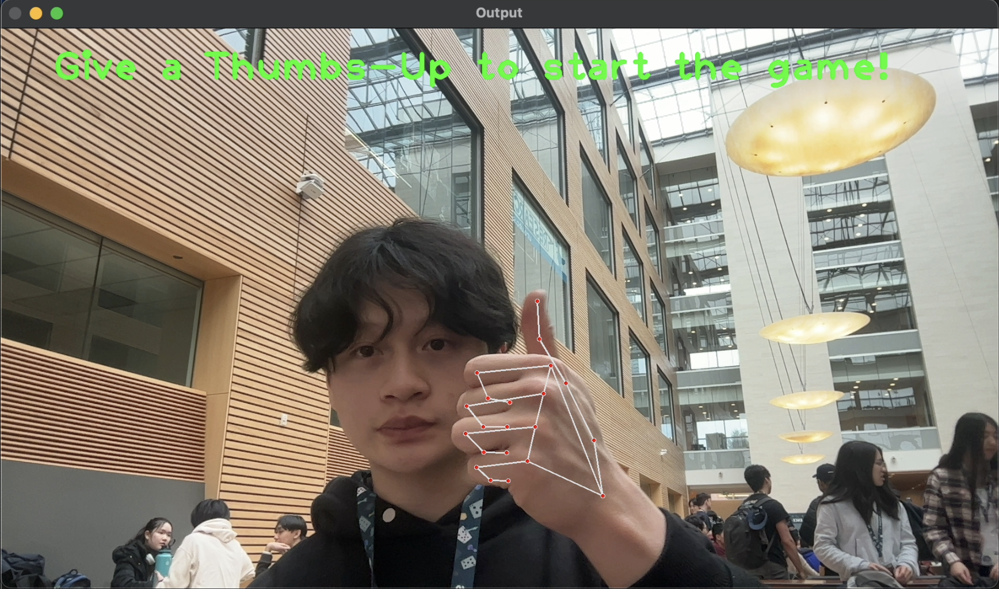

# PUNCH-N-RUN


### To try our project, you need to install the following dependencies:

```bash
pip install opencv-python
pip install mediapipe
pip install tensorflow
```

Note: For some users, the start authentification with the thumbs up doesn't work as intended. To still play the game, just set the global variable `GAME_HAS_STARTED` to `True` in `acutalgame.py`. This will bypass the gesture recognition which should (hopefully) let you still run the game.

## Use case


## Inspiration
- Inspired by the challenge of making exercising enjoyable, our goal was to create an engaging experience that transforms physical activity into a fun part of our daily lives.

## What it does
- Features a character navigating the screen, encountering walls that players engage with by physically punching towards their screens to make them disappear, blending physical activity with interactive gameplay.

## How we built it
- We used the MediaPipe Hand Landmarker task from Google to pinpoint landmarks on the user. Game logic was handled using Pygame. 

## Challenges we ran into
- Integrating the hand gesture models and adjusting sensitivities and parameters

## Accomplishments that we're proud of
- Creating a product that genuinely benefits our intended audience.
- Working fluidly and efficiently as a team, both during struggles and successes.
- Bouncing different ideas off one another to find different approaches to the same problem

## What we learned
- How to create a fun and interactive game using computer vision
- Efficient game production using the Pygame framework
- The benefits of efficient Git management (pulling, pushing, merging) within a team.

Coded by Andy, Anusha, Derek, and Eric at nwHacks 2024

[DevPost Link](https://devpost.com/software/punch-n-run)
